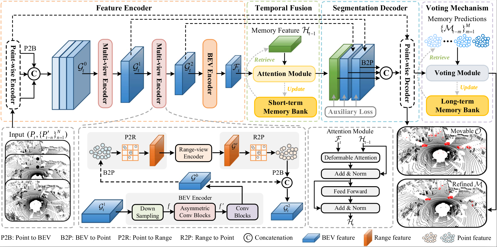

<h1 align="center"> StreamMOS: Streaming Moving Object Segmentation with Multi-View Perception and Dual-Span Memory </h1>

<div align="center">

**Zhiheng Li**, Yubo Cui, Jiexi Zhong, Zheng Fang*

[](https://arxiv.org/abs/2407.17905)

</div>

## Absract

Moving object segmentation based on LiDAR is a crucial and challenging task for autonomous driving and mobile robotics. Most approaches explore spatio-temporal information from LiDAR sequences to predict moving objects in the current frame. However, they often focus on transferring temporal cues in a single inference and regard every prediction as independent of others. This may cause inconsistent segmentation results for the same object in different frames. To overcome this issue, **we propose a streaming network with a memory mechanism, called StreamMOS**, to build the association of features and predictions among multiple inferences. Specifically, we utilize a short-term memory to convey historical features, which can be regarded as spatial prior of moving objects and adopted to enhance current inference by temporal fusion. Meanwhile, we build a long-term memory to store previous predictions and exploit them to refine the present forecast at voxel and instance levels through voting. Besides, we present multi-view encoder with cascade projection and asymmetric convolution to extract motion feature of objects in different representations. 
Extensive experiments validate that our algorithm gets competitive performance on SemanticKITTI and Sipailou Campus datasets.

## Overview
<p align="center">
    
</p>

**The overall architecture of StreamMOS**. (a) Feature encoder adopts a point-wise encoder to extract point features and project them into BEV. Then, the multi-view encoder with cascaded structure and asymmetric convolution is applied to encode motion features from different views. (b) Temporal fusion utilizes an attention module to propagate memory feature to the current inference. (c) Segmentation decoder with parameter-free upsampling exploits multi-scale features to predict class labels. (d) Voting mechanism leverages memory predictions to optimize the motion state of each 3D voxel and instance.

<!--## Challenging Scenes

-->

## Quickstart

### 0. Data Download

## Acknowledgement

This repo is based on [CPGNet](https://github.com/GangZhang842/CPGNet) and [SMVF](https://github.com/GangZhang842/SMVF), we are very grateful for their excellent work.                     

## Citation

If you find our repository useful, please consider citing us as
```
@ARTICLE{10804055,
  author={Li, Zhiheng and Cui, Yubo and Zhong, Jiexi and Fang, Zheng},
  journal={IEEE Robotics and Automation Letters}, 
  title={StreamMOS: Streaming Moving Object Segmentation With Multi-View Perception and Dual-Span Memory}, 
  year={2025},
  volume={10},
  number={2},
  pages={1146-1153},
  keywords={Laser radar;Three-dimensional displays;Motion segmentation;Feature extraction;Point cloud compression;Object segmentation;Heuristic algorithms;Convolution;Dynamics;Decoding;Computer vision for transportation;deep learning methods;semantic scene understanding},
  doi={10.1109/LRA.2024.3518844}}
```
